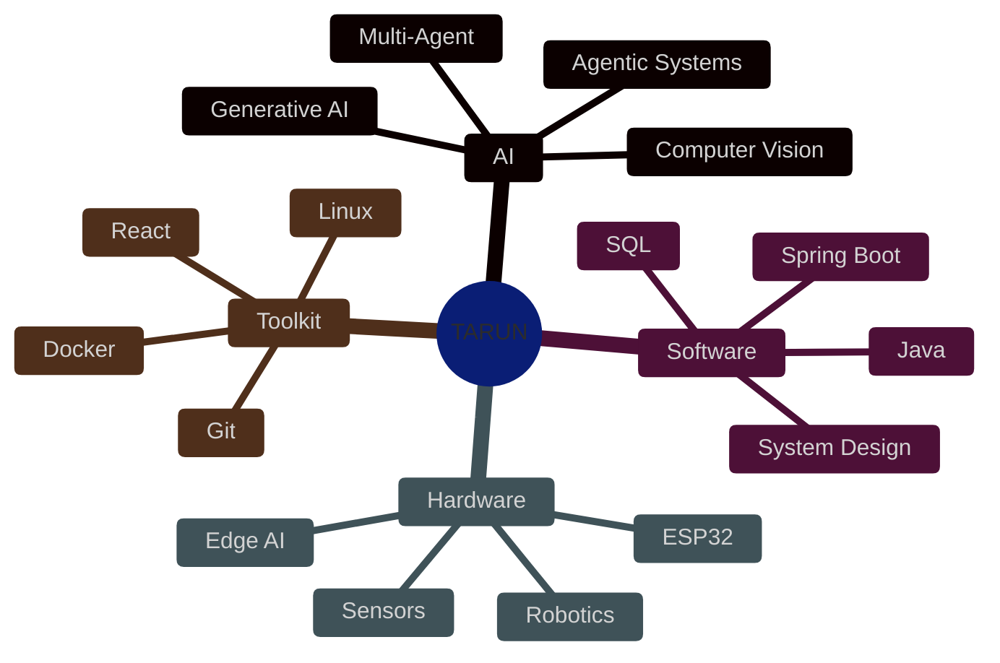
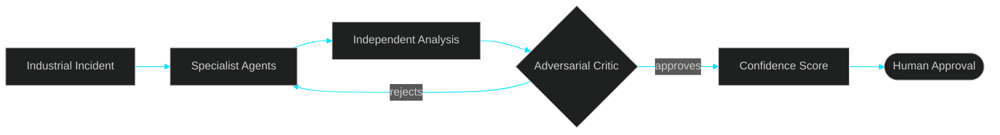
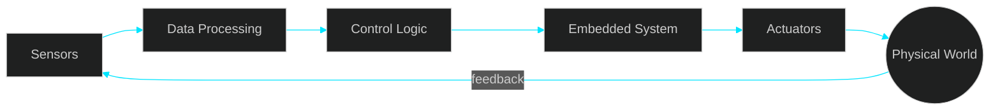
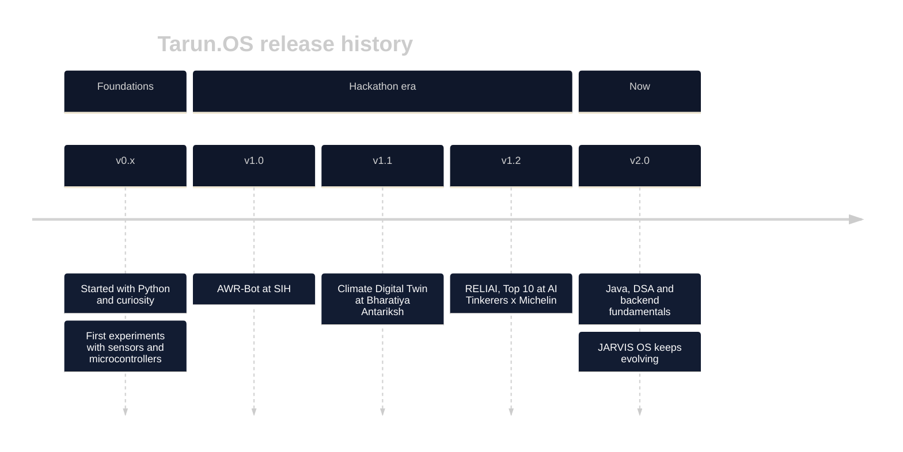
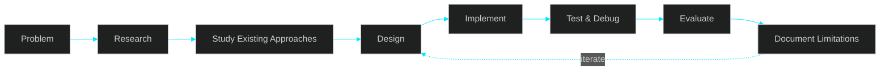
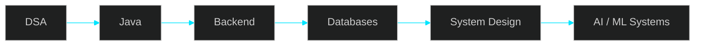

<!-- ==========================================================
              TARUN.OS  //  PLAYER PROFILE  //  v2026
========================================================== -->


<div align="center">


<br/>

<a href="https://github.com/tarunkkumarsahu"></a>
<a href="https://github.com/tarunkkumarsahu?tab=followers"></a>


</div>

```text
   ████████╗ █████╗ ██████╗ ██╗   ██╗███╗   ██╗
   ╚══██╔══╝██╔══██╗██╔══██╗██║   ██║████╗  ██║
      ██║   ███████║██████╔╝██║   ██║██╔██╗ ██║
      ██║   ██╔══██║██╔══██╗██║   ██║██║╚██╗██║
      ██║   ██║  ██║██║  ██║╚██████╔╝██║ ╚████║
      ╚═╝   ╚═╝  ╚═╝╚═╝  ╚═╝ ╚═════╝ ╚═╝  ╚═══╝
              >> INSERT COIN TO CONTINUE <<
```

---

# `> character_sheet`

<table>
<tr>
<td width="58%" valign="top">
<pre>
╔══════════════════════════════════════════════════════╗
║  NAME    : Tarun Kumar Sahu                          ║
║  CLASS   : Builder (AI Engineer / Roboticist hybrid) ║
║  LEVEL   : CS Student — grinding                     ║
║  GUILD   : AI Tinkerers · Hackathon circuit          ║
║  MOTTO   : Understand deeply. Build practically.     ║
║            Validate honestly.                        ║
╠══════════════════════════════════════════════════════╣
║  STATS                                               ║
║                                                      ║
║  AGENTIC AI      ████████░░  8/10                    ║
║  PYTHON          ████████░░  8/10                    ║
║  ROBOTICS / IoT  ███████░░░  7/10                    ║
║  COMPUTER VISION ███████░░░  7/10                    ║
║  JAVA            █████░░░░░  5/10  ← leveling up     ║
║  DSA             █████░░░░░  5/10  ← leveling up     ║
║  BACKEND         █████░░░░░  5/10  ← leveling up     ║
║  SYSTEM DESIGN   ███░░░░░░░  3/10  ← next boss       ║
╚══════════════════════════════════════════════════════╝
</pre>
</td>
<td width="42%" valign="top">
<h3><code>&gt; quick_access</code></h3>
<pre>
LIVE PORTFOLIO : ONLINE
CURRENT QUEST  : JARVIS OS
FOCUS          : AI · BACKEND · ROBOTICS
STATUS         : BUILDING / OPEN TO COLLAB
MODE           : SHIP → LEARN → ITERATE
</pre>
<p align="center">
<a href="https://tarun-portfolio-zeta-teal.vercel.app/"></a>
<br/>
<a href="https://github.com/tarunkkumarsahu"></a>
<a href="https://linkedin.com/in/tarunkkumarsahu"></a>
<br/>
<a href="https://tarun-portfolio-zeta-teal.vercel.app/resume/Tarun-Kumar-Sahu-Resume.pdf"></a>
</p>
</td>
</tr>
</table>

<sub>Stats are self-rated and updated as I level up. Honesty is the whole point of this profile.</sub>

---

# `> now_playing`

<div align="center">

| 🔨 ACTIVE QUEST | 📖 TRAINING | 🚢 LAST LOOT | 🎯 NEXT UNLOCK |
|:---:|:---:|:---:|:---:|
| JARVIS OS | Java · DSA · Spring Boot | `<< edit: latest thing you shipped >>` | Backend + System Design |

</div>

---

# `> skill_tree`



---

# `> the_honesty_ladder`

Every quest gets rated on the ladder below. It's my one house rule.

```text
  🔍 RESEARCHED  →  ⚙️ IMPLEMENTED  →  📏 VALIDATED  →  🚀 PRODUCTION
    "I read it"      "It runs"        "I measured it"   "People rely on it"
```

> Researched ≠ Implemented · Implemented ≠ Validated · Demo ≠ Production

---

# `> quest_log`

## 📜 QUEST 01 · RELIAI

```text
┌──────────────────────────────────────────────────────┐
│ MISSION BRIEFING            CLEARANCE: TOP 10 🏆     │
│ Event : AI Tinkerers × Michelin Harness Engineering  │
│ Goal  : Investigate an industrial incident WITHOUT   │
│         trusting a single LLM's opinion              │
└──────────────────────────────────────────────────────┘
```



```text
🔍 RESEARCHED   ██████████
⚙️ IMPLEMENTED  ████████░░
📏 VALIDATED    ████░░░░░░
🚀 PRODUCTION   ░░░░░░░░░░
```

**⚔️ Weapons:** multi-agent orchestration · critic-based validation · human-in-the-loop
**💀 Boss fight (biggest failure):** `<< edit: what went wrong and what you learned >>`

---

## 📜 QUEST 02 · CLIMATE DIGITAL TWIN

```text
┌──────────────────────────────────────────────────────┐
│ MISSION BRIEFING          EVENT: Bharatiya Antariksh │
│ Goal : Turn raw environmental data into a living,    │
│        explorable model of a changing planet         │
└──────────────────────────────────────────────────────┘
```


```text
🔍 RESEARCHED   █████████░
⚙️ IMPLEMENTED  ███████░░░
📏 VALIDATED    ███░░░░░░░
🚀 PRODUCTION   ░░░░░░░░░░
```

**⚔️ Weapons:** data pipelines · AI-assisted analysis · visualization
**💀 Boss fight:** `<< edit >>`

---

## 📜 QUEST 03 · AWR-BOT

[](https://github.com/tarunkkumarsahu/AWR-Bot-)

```text
┌──────────────────────────────────────────────────────┐
│ MISSION BRIEFING                     EVENT: SIH      │
│ Goal : Make software decisions move real metal, and  │
│        survive contact with the physical world       │
└──────────────────────────────────────────────────────┘
```



```text
🔍 RESEARCHED   ████████░░
⚙️ IMPLEMENTED  ███████░░░
📏 VALIDATED    ███░░░░░░░
🚀 PRODUCTION   ░░░░░░░░░░
```

**⚔️ Weapons:** sensor integration · embedded control · hardware-software comms
**💀 Boss fight:** `<< edit: the nastiest sensor or hardware bug >>`

---

## 📜 QUEST 04 · JARVIS OS  ·  `ONGOING`

[](https://github.com/tarunkkumarsahu/Jarvis-OS)

```text
┌──────────────────────────────────────────────────────┐
│ MISSION BRIEFING                  TYPE: LONG CAMPAIGN│
│ Goal : A personal AI with memory, tools, desktop     │
│        control and voice. Not just a chatbot.        │
└──────────────────────────────────────────────────────┘
```


```text
🔍 RESEARCHED   █████████░
⚙️ IMPLEMENTED  ██████░░░░
📏 VALIDATED    ██░░░░░░░░
🚀 PRODUCTION   ░░░░░░░░░░   ← intentionally R&D, not overclaimed
```

**⚔️ Weapons:** agent orchestration · memory architecture · tool execution
**💀 Boss fight:** `<< edit >>`

---

# `> achievements`

<div align="center">

| | Achievement | Unlocked by |
|:---:|:---|:---|
| 🏆 | **Top 10 Finisher** | RELIAI at the AI Tinkerers × Michelin hackathon |
| 🛰️ | **Space Cadet** | Climate Digital Twin at Bharatiya Antariksh Hackathon |
| 🦾 | **Metal Mover** | AWR-Bot: software that actually moves hardware |
| 🧪 | **Mad Scientist** | JARVIS OS: still experimenting |
| 🔒 | **???** | `<< add your next achievement >>` |

</div>

---

# `> patch_notes`



<sub>Edit the entries with real dates and milestones.</sub>

---

# `> inventory`

<div align="center">


</div>

---

# `> lore`

<details>
<summary><b>▶ How I build (the process)</b></summary>

<br/>



Four questions for every serious project: **What did I study? Why this architecture? What did I actually build? What did I validate?**

</details>

<details>
<summary><b>▶ The five house rules</b></summary>

<br/>

1. **Understand before automating.** AI should speed up engineering, not replace understanding.
2. **Research before implementing.**
3. **Validate before claiming.** Experiment, demo, measured result and production are different things.
4. **Design for failure.** Real systems break.
5. **Build to learn.** A serious prototype is an experiment that produces understanding.

</details>

<details>
<summary><b>▶ Current campaign roadmap</b></summary>

<br/>



</details>

---

# `> telemetry`

<div align="center">


</div>

<details>
<summary><b>▶ Commit activity (last 30 days)</b></summary>

<div align="center">

<br/>

**All repositories**


**Structured-DSA**

<a href="https://github.com/tarunkkumarsahu/Structured-DSA">
  
</a>

<sub>Last 30 days · UTC · Refreshed daily</sub>

</div>

</details>

<!-- OPTIONAL: Snake animation (needs the Platane/snk GitHub Action)
<div align="center">
  
</div>
-->

---

# `> secret_level`

```console
tarun@github:~$ ls -a ~/hidden
.konami_code   .coffee_dependency   .todo_never_ending

tarun@github:~$ sudo hire tarun
[sudo] password for recruiter: ********
Access granted. ✔  Opening: mailto:tarunkumarsahu354@gmail.com ...

tarun@github:~$ fortune
"Some experiments become products. Some stay prototypes.
 Some just answer a technical question. All three count."
```

---

# `> multiplayer`

<div align="center">

<a href="https://linkedin.com/in/tarunkkumarsahu"></a>
<a href="https://github.com/tarunkkumarsahu"></a>
<a href="https://tarun-portfolio-zeta-teal.vercel.app/"></a>
<a href="mailto:tarunkumarsahu354@gmail.com"></a>

<br/><br/>

### `< Research. Understand. Build. Validate. />`
**GAME NOT OVER. CONTINUE? [ Y ]**


</div>