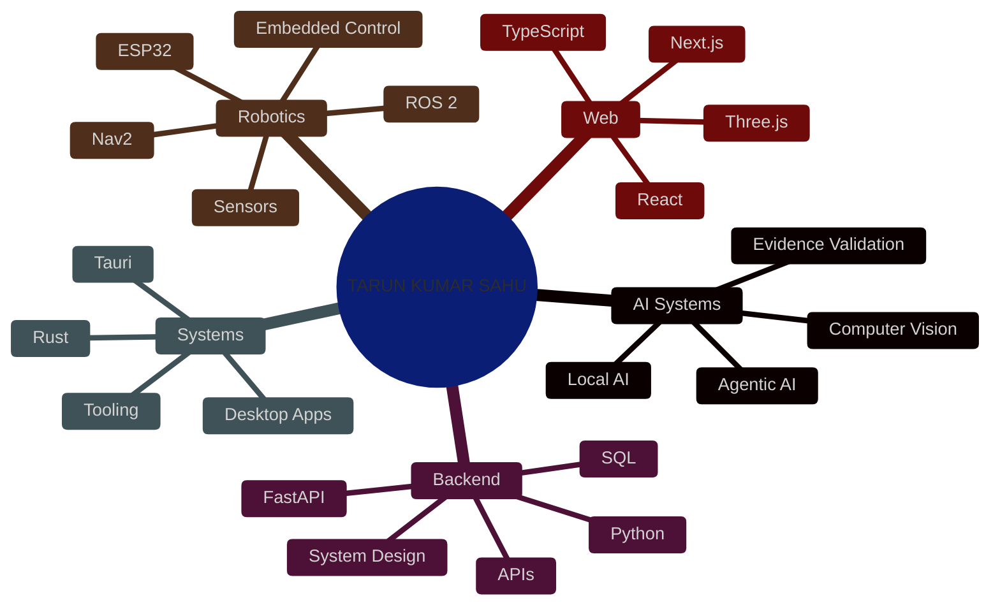

<!-- ==========================================================
              TARUN.OS  //  PLAYER PROFILE  //  v2026
========================================================== -->


# Tarun Kumar Sahu

**Software Engineer · AI & Backend Developer · Robotics & Computer Vision Builder**

This is the official GitHub profile of **Tarun Kumar Sahu** — **[@tarunkkumarsahu](https://github.com/tarunkkumarsahu)**. I build experimental and production-oriented software across **AI systems, backend engineering, Rust, computer vision, robotics, connected hardware and developer tooling**.

[Portfolio](https://tarun-portfolio-zeta-teal.vercel.app/) · [GitHub](https://github.com/tarunkkumarsahu) · [LinkedIn](https://linkedin.com/in/tarunkkumarsahu) · [Resume](https://tarun-portfolio-zeta-teal.vercel.app/resume/Tarun-Kumar-Sahu-Resume.pdf)

<div align="center">


<br/>

<a href="https://github.com/tarunkkumarsahu"></a>
<a href="https://github.com/tarunkkumarsahu?tab=followers"></a>


</div>

---

# `> identity`

```text
NAME          : Tarun Kumar Sahu
GITHUB        : @tarunkkumarsahu
ROLE          : Software Engineer / AI + Backend Builder
FOCUS         : AI Systems · Backend · Robotics · Computer Vision
LANGUAGES     : Python · Rust · Java · C/C++ · TypeScript
CURRENT MODE  : Build → Test → Document → Improve
LOCATION      : India
```

I care about one engineering rule more than hype:

> **Researched ≠ Implemented · Implemented ≠ Validated · Demo ≠ Production**

---

# `> active_systems`

| Project | What it is | Current signal |
|---|---|---|
| **[EXOCROTEX](https://github.com/tarunkkumarsahu/EXOCROTEX)** | Rust-first cognitive extension with persistent memory, evidence state, Tauri desktop and local AI | Rust + Windows desktop CI passing |
| **[FreshFusion](https://github.com/tarunkkumarsahu/Fresh-Fusion-)** | Multimodal fruit-quality investigation using vision, ESP32 sensing, evidence validation and local AI | Full-stack experimental system; validation ongoing |
| **[RAKSHA Grid](https://github.com/tarunkkumarsahu/raksha-grid)** | Disaster-response intelligence for incident routing, shelters, GIS and coordination | Backend release/integration stage |
| **[AWR-Bot](https://github.com/tarunkkumarsahu/AWR-Bot-)** | ROS 2 warehouse AMR with mission planning, Nav2, Gazebo and modular payload workflow | End-to-end mission demonstrated; broader validation ongoing |
| **[AgriNexus ProofOS](https://github.com/tarunkkumarsahu/agrinexus-ai)** | Evidence-driven agriculture decision prototype across web, Android scaffold and FastAPI | Working web/backend prototype |
| **[JARVIS OS](https://github.com/tarunkkumarsahu/Jarvis-OS)** | Personal AI operating layer with memory, tools, providers and desktop interaction | Active early-alpha R&D |

---

# `> skill_tree`



---

# `> engineering_principles`

1. **Understand before automating.** AI should accelerate engineering, not replace understanding.
2. **Research before implementation.** Existing approaches deserve study before reinvention.
3. **Validate before claiming.** A working demo is not the same as a measured system.
4. **Design for failure.** Real systems fail at boundaries, integrations and assumptions.
5. **Document limitations.** Honest constraints make technical work more credible.
6. **Ship, learn, iterate.** Progress should leave working artifacts behind.

---

# `> current_campaign`

```text
DSA → Java → Backend Engineering → Databases → System Design
                                  ↓
                         AI / Robotics Systems
```

Alongside fundamentals, I keep building substantial systems so theory gets tested against real implementation constraints.

---

# `> achievements`

| Achievement | Context |
|---|---|
| **Top 10 Finisher** | RELIAI — AI Tinkerers × Michelin Harness Engineering |
| **Climate Digital Twin** | Bharatiya Antariksh Hackathon |
| **Warehouse AMR** | SIH26112 / AWR-Bot engineering track |
| **JARVIS OS** | Long-term personal AI systems R&D |

---

# `> inventory`

<div align="center">


</div>

---

# `> telemetry`

<div align="center">


</div>

<details>
<summary><b>▶ Commit activity</b></summary>

<div align="center">

<br/>

**All repositories — last 30 days**


**Structured-DSA**

<a href="https://github.com/tarunkkumarsahu/Structured-DSA">
  
</a>

<sub>UTC · refreshed automatically</sub>

</div>

</details>

---

# `> connect`

<div align="center">

<a href="https://linkedin.com/in/tarunkkumarsahu"></a>
<a href="https://github.com/tarunkkumarsahu"></a>
<a href="https://tarun-portfolio-zeta-teal.vercel.app/"></a>
<a href="mailto:tarunkumarsahu354@gmail.com"></a>

<br/><br/>

### `< Research. Understand. Build. Validate. />`

**Tarun Kumar Sahu · @tarunkkumarsahu**


</div>
