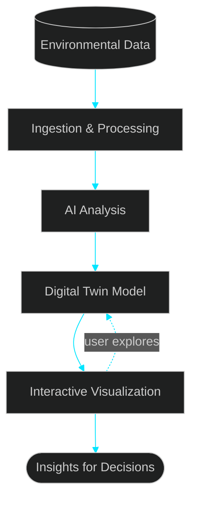
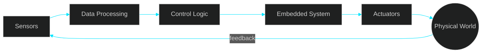
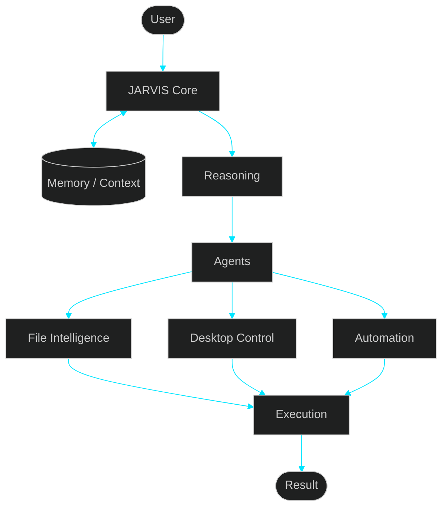
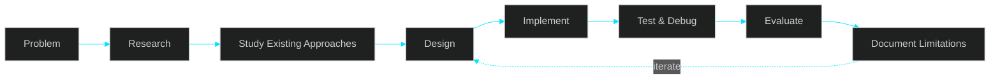
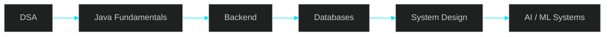

<!-- ==========================================================
                     TARUN KUMAR SAHU
             GitHub Profile // Developer Console
========================================================== -->


<div align="center">


<br/>

<a href="https://github.com/tarunkkumarsahu">
  
</a>
<a href="https://github.com/tarunkkumarsahu?tab=followers">
  
</a>
<a href="https://github.com/tarunkkumarsahu?tab=repositories">
  
</a>

</div>

---

# `> whoami`

```console
tarun@github:~$ whoami
Tarun Kumar Sahu — CS student · AI & software builder

tarun@github:~$ cat interests.txt
agentic-ai  software-engineering  computer-vision  robotics  edge-ai  backend

tarun@github:~$ cat learning.txt
java  dsa  spring-boot  sql  system-design  generative-ai  multi-agent-systems

tarun@github:~$ echo $PHILOSOPHY
Understand deeply. Build practically. Validate honestly.
```

---

# `> now`

<div align="center">

| 🔨 BUILDING | 📚 LEARNING | 🚢 LAST SHIPPED | 🎯 NEXT |
|:---:|:---:|:---:|:---:|
| JARVIS OS | Java · DSA · Spring Boot | `<< edit: your latest project/feature >>` | Backend + System Design |

</div>

---

# `> honesty_ladder`

Yeh mera signature hai. Har project ko main is ladder pe honestly rate karta hoon:

```text
RESEARCHED  →  IMPLEMENTED  →  VALIDATED  →  PRODUCTION
   "I read"     "It runs"      "I measured"   "People rely on it"
```

> Researched ≠ Implemented · Implemented ≠ Validated · Demo ≠ Production

---

# `> featured_projects`

## 🤖 RELIAI — Multi-Agent Industrial Investigation
**AI Tinkerers × Michelin Harness Engineering Hackathon · Top 10 🏆**

Ek LLM ko single decision-maker banane ki jagah, industrial incident ko specialized reasoning stages mein todna.


```text
RESEARCHED   ██████████
IMPLEMENTED  ████████░░
VALIDATED    ████░░░░░░
PRODUCTION   ░░░░░░░░░░
```

**Focus:** agent orchestration · critic-based validation · uncertainty · human-in-the-loop
**🪲 Failure story:** `<< edit: sabse bada bug ya galat assumption kya tha? >>`

---

## 🌍 CLIMATE DIGITAL TWIN — Environmental Intelligence
**Bharatiya Antariksh Hackathon**

Environmental data ko ek interactive, badalti hui representation mein convert karna.



```text
RESEARCHED   █████████░
IMPLEMENTED  ███████░░░
VALIDATED    ███░░░░░░░
PRODUCTION   ░░░░░░░░░░
```

**Focus:** data pipelines · AI-assisted analysis · visualization
**🪲 Failure story:** `<< edit >>`

---

## 🦾 AWR-BOT — AI + Robotics Prototype
**SIH work** · [](https://github.com/tarunkkumarsahu/AWR-Bot-)

Software decisions jab physical actions banate hain, tab real-world constraints saamne aate hain.



```text
RESEARCHED   ████████░░
IMPLEMENTED  ███████░░░
VALIDATED    ███░░░░░░░
PRODUCTION   ░░░░░░░░░░
```

**Focus:** sensor integration · embedded control · hardware-software communication
**🪲 Failure story:** `<< edit: e.g. sabse bada hardware/sensor bug >>`

---

## 🧠 JARVIS OS — Personal AI Systems R&D
[](https://github.com/tarunkkumarsahu/Jarvis-OS)

Personal AI jo chatbot se aage jaye: memory, tools, desktop interaction, voice.



```text
RESEARCHED   █████████░
IMPLEMENTED  ██████░░░░
VALIDATED    ██░░░░░░░░
PRODUCTION   ░░░░░░░░░░   ← intentionally R&D, not overclaimed
```

**Focus:** agent orchestration · memory architecture · tool execution
**🪲 Failure story:** `<< edit >>`

---

# `> stack`

<div align="center">


</div>

```text
LANGUAGES  Java · Python · C++ · C · JavaScript
AI         ML · Computer Vision · GenAI · Multi-Agent · Automation
BACKEND    Spring Boot · REST · SQL · PostgreSQL · MySQL
WEB        React · HTML · CSS
TOOLS      Git · GitHub · Linux · Docker · VS Code · IntelliJ
EDGE       ESP32 · Sensors · IoT · Robotics
```

---

# `> how_i_build`

<details>
<summary><b>▶ Mera process (expand)</b></summary>

<br/>



Har serious project pe 4 sawaal:

1. **Kya study kiya?** Problem, existing approaches, unki limitations
2. **Yeh architecture kyun?** Trade-offs kya the
3. **Actually kya build kiya?** Data flow, failure handling
4. **Kya validate kiya?** Tests, metrics, kya sirf prototype hai

</details>

<details>
<summary><b>▶ Engineering principles (expand)</b></summary>

<br/>

1. **Understand before automating.** AI engineering ko accelerate kare, understanding ko replace nahi.
2. **Research before implementing.**
3. **Validate before claiming.** Experiment, demo, measured result, production alag cheezein hain.
4. **Design for failure.** Real systems fail hote hain.
5. **Build to learn.** Serious prototype = technical understanding ka experiment.

</details>

<details>
<summary><b>▶ Current focus roadmap (expand)</b></summary>

<br/>



</details>

---

# `> github_telemetry`

<div align="center">


</div>

<details>
<summary><b>▶ Commit activity (last 30 days)</b></summary>

<div align="center">

<br/>

**All repositories**


**Structured-DSA**

<a href="https://github.com/tarunkkumarsahu/Structured-DSA">
  
</a>

<sub>Last 30 days · UTC · Refreshed daily</sub>

</div>

</details>

<!-- OPTIONAL: Snake animation (needs a GitHub Action, see notes)
<div align="center">
  
</div>
-->

---

# `> beyond_code`

Mujhe woh projects pasand hain jahan **software screen se nikal ke real world se interact karta hai**: robotics, IoT, computer vision, environmental intelligence, hackathons, open-ended experiments.

Kuch experiments products ban jaate hain. Kuch prototype rehte hain. Kuch bas ek technical sawaal ka jawab dete hain. Teeno valuable hain, agar genuine understanding milti hai.

---

# `> easter_egg`

```console
tarun@github:~$ sudo hire tarun
[sudo] password for recruiter: ********
Access granted. ✔
Opening: mailto:tarunkumarsahu354@gmail.com ...
```

---

# `> connect`

<div align="center">

<a href="https://linkedin.com/in/tarunnsahuu"></a>
<a href="https://github.com/tarunkkumarsahu"></a>
<a href="https://github.com/tarunkkumarsahu/tarun-portfolio"></a>
<a href="mailto:tarunkumarsahu354@gmail.com"></a>

<br/><br/>

### `< Research. Understand. Build. Validate. />`


</div>
